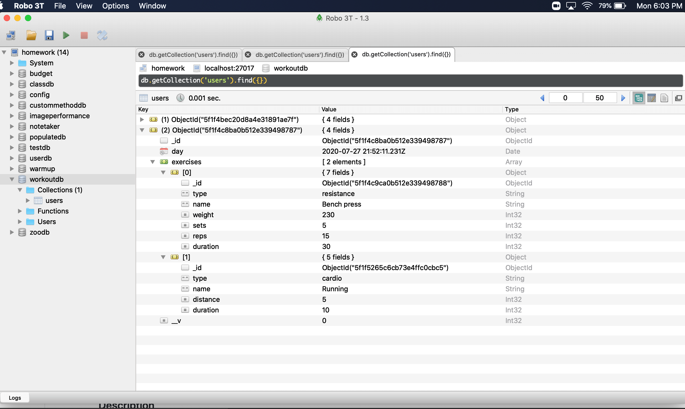
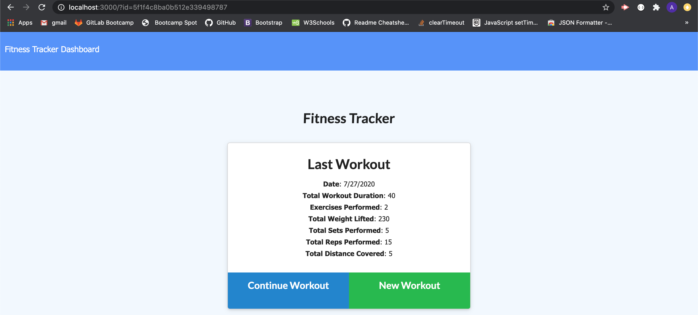
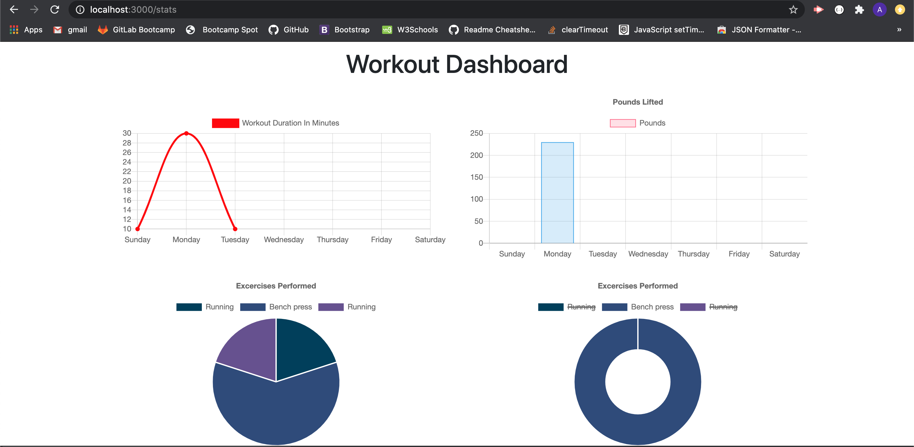

# workout-tracker
### Objective
A Workout tracker used to track and create the daily workouts using Node JS, Express, MongoDB with a Mongoose schema.

### Description

* An application to track the daily workouts,Once landed the webpage will show the detials about the last workout performed . 
* Create new workouts using New Workout button to track the name, type, weight, sets, reps, and duration of exercise.
* If the exercise is a cardio exercise, should be able to track the distance traveled also.
* Can also continue to work on previous workout by clicking on Continue Workout button.
* Storing every workouts in a database

### Database
* workoutdb has a collection named 'users'

### Installation
Steps to install the node npm packages

* npm i
### Dependencies
* express
* mongoose
* morgan

Note: They already included in npm package.json
### Usage
* `git clone git@github.com:Anitha-Venkatesan/workout-tracker.git`
* `cd workout-tracker`
* Open server.js in Command Line Terminal using the command `node server.js`
### Screenshots

### Heroku Deployed URL
* [Demo](https://safe-mountain-59249.herokuapp.com/)

### License
* This program is licensed under the MIT license.
### References
* https://masteringjs.io/tutorials/mongoose
* https://mongoosejs.com/docs/api.html#model_Model.find

### Questions
If you have any questions, Please feel free to contact me Anitha Venkatesan on my email anithamca68@gmail.com

You can also create [issues](https://github.com/Anitha-Venkatesan/workout-tracker/issues) on my repo.

